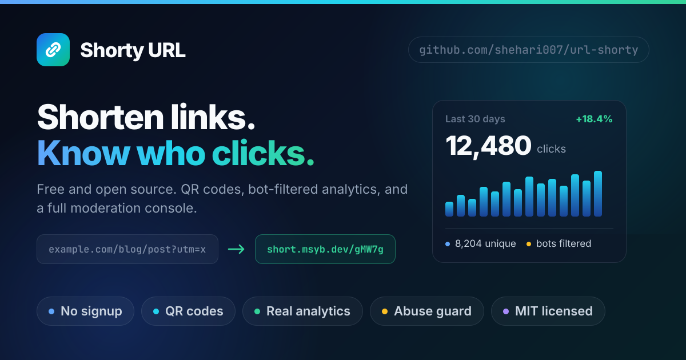
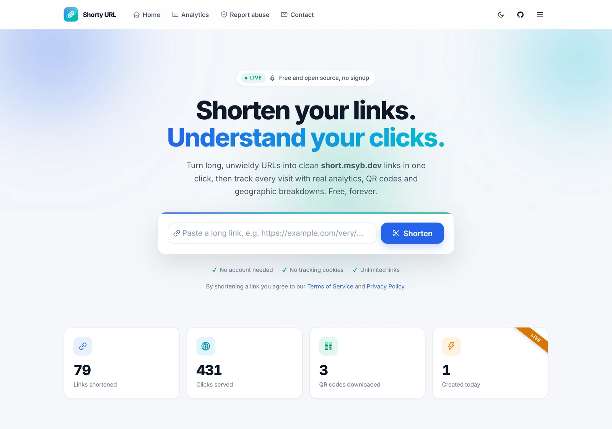
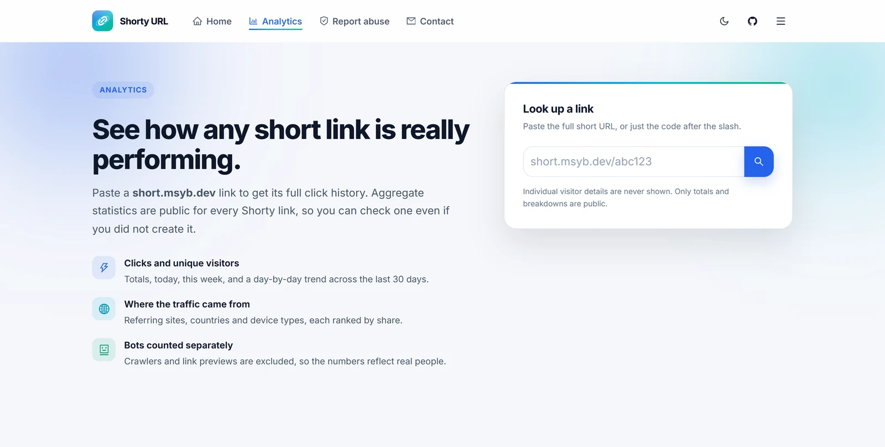
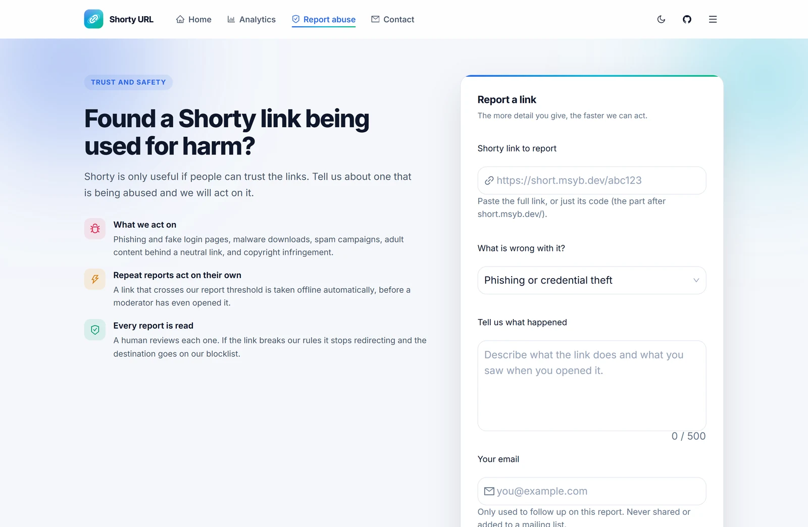
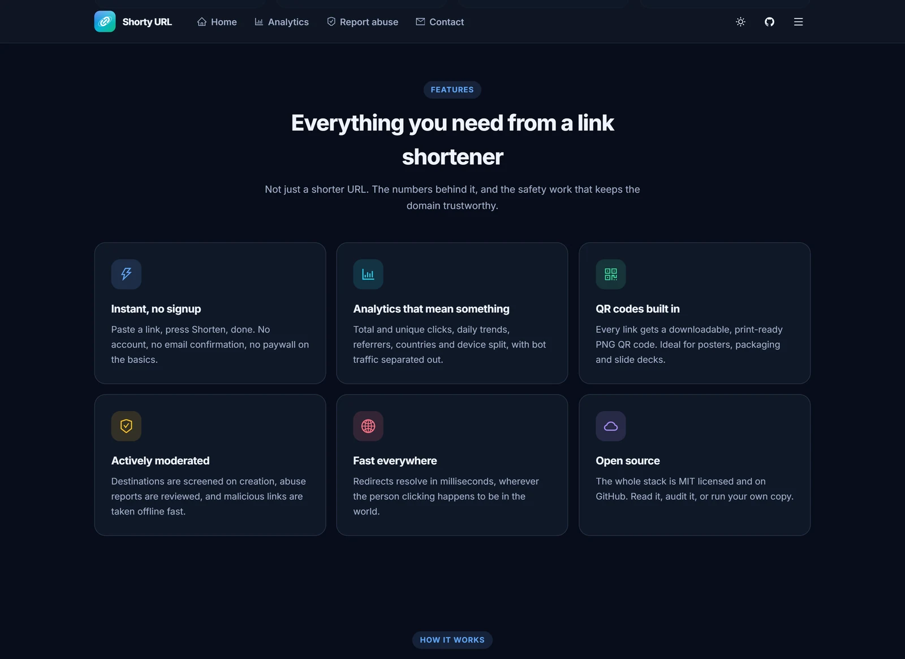

<div align="center">


# Shorty URL

**Open-source, self-hosted URL shortener with real click analytics, QR codes and a full moderation console — a free Bitly alternative you can run on your own domain.**

[](https://shorty.msyb.dev)
[](#-quick-start)
[](#-documentation)

[](https://github.com/shehari007/url-shorty/releases/latest)
[](https://github.com/shehari007/url-shorty/stargazers)
[](https://github.com/shehari007/url-shorty/network/members)
[](https://github.com/shehari007/url-shorty/issues)
[](https://github.com/shehari007/url-shorty/commits/main)
[](LICENSE)

[](https://nextjs.org)
[](https://react.dev)
[](https://www.typescriptlang.org)
[](https://ant.design)
[](https://expressjs.com)
[](https://orm.drizzle.team)
[](https://www.mysql.com)



</div>

---

## 🆕 What's new in v3.0.1

A maintenance release — full detail in the [changelog](CHANGELOG.md#301--2026-08-17).

- **Domain blocking is retroactive and covers subdomains.** Blocking a domain now takes
  offline the links that already point at it, and one entry covers the apex, `www.` and
  every subdomain.
- **A round of security fixes**, including an admin account-enumeration oracle in the login
  endpoint, a "revoke sessions" action that did not actually revoke sessions, CSRF
  protection on the admin console, and several SSRF-guard bypasses. See the
  [Security section of the changelog](CHANGELOG.md#security).
- **First tests** (Vitest) covering the URL-safety guard and crypto helpers.
- Repository docs: contributing guide, security policy, changelog, issue and PR templates.

## 📑 Contents

[What's new](#-whats-new-in-v301) · [Why Shorty](#-why-shorty) · [Screenshots](#-screenshots) · [Features](#-features) · [Quick start](#-quick-start) · [Project layout](#-project-layout) · [Documentation](#-documentation) · [Roadmap](#-roadmap) · [Contributing](#-contributing) · [Security](#-security) · [FAQ](#-faq) · [Licence](#-licence)

---

## 💡 Why Shorty

Shorty is a **self-hosted URL shortener** you can point at your own short domain. It is a
practical **open source alternative to Bitly, TinyURL and Short.io** for anyone who would
rather not hand their click data — or their audience's — to someone else's analytics
product.

Where most self-hosted shorteners stop at "long URL in, short URL out", Shorty ships the
part that actually takes the time to build: a **role-based moderation console**. Abuse
reports get triaged, destinations get blocked, every admin action lands in an append-only
audit log, and bot traffic is separated from real clicks before it ever reaches a chart.

It runs on **MySQL 8 or TiDB**, is written end-to-end in **TypeScript**, and is **MIT
licensed**. No account is required to shorten a link, and there is no paywall on analytics.

## 📸 Screenshots

| Home | Link analytics |
| :---: | :---: |
|  |  |

| Abuse reporting | Dark theme |
| :---: | :---: |
|  |  |

> [!NOTE]
> Admin console screenshots are still to come — see [Roadmap](#-roadmap). They need a
> seeded database first, since the real console shows destination URLs, reporter emails
> and visitor detail.

## ✨ Features

### 🌐 Public

- **One-click shortening.** No account, no signup, no paywall.
- **Real analytics.** Total and unique clicks, 30-day trend, referrers, countries and devices, with bot traffic separated out.
- **QR codes.** Downloadable, print-ready PNG for every link.
- **Abuse reporting.** Structured categories, auto-flagging, and auto-block on repeated reports.
- **Light and dark themes.** With no flash of the wrong theme on load.
- **Built for SEO.** Server-rendered pages, per-route metadata, JSON-LD (`WebApplication`, `FAQPage`, `HowTo`), `sitemap.xml`, `robots.txt`, canonical URLs, and OpenGraph/Twitter cards.

### 🧰 Admin console (`/admin`)

- **Overview.** Links, clicks, pending reports and messages at a glance, with 30-day trend charts.
- **Links.** Search and filter by status/domain/date; block, unblock, expire, reactivate, soft-delete, restore, edit title/note/expiry, and bulk actions. Per-link drawer with full analytics and recent visitor detail.
- **Reports.** Triage queue with one-click "resolve and block the link".
- **Messages.** Inbox for the contact form, with statuses and internal notes.
- **Blocked domains.** Blocking a domain is retroactive: it refuses new links *and* takes offline every link already pointing there, reporting how many. One entry covers the apex, `www.` and every subdomain automatically, so blocking `evil.com` also stops `www.evil.com` and `login.evil.com`.
- **Audit log.** Append-only record of every admin action, including failed sign-ins.
- **Admin accounts.** Owner-only management with three roles.

### 🔒 Security

- Password hashing with **bcrypt (bcryptjs) at cost 12**, short-lived HS256 access tokens, and rotating opaque refresh tokens stored hashed.
- Tokens live in **httpOnly cookies** held by the Next.js server, never in `localStorage`, so injected script cannot read them.
- **Role-based access control** (`owner` > `admin` > `moderator`) enforced server-side.
- **Account lockout** after repeated failed sign-ins, and every sign-in failure returns an identical response after identical work, so the endpoint cannot be used to discover which addresses are real.
- **SSRF/abuse guard.** Private, loopback, link-local, CGNAT and reserved-TLD destinations are refused, including IPv4-mapped IPv6 forms such as `[::ffff:a9fe:a9fe]`, as are URLs carrying embedded credentials.
- **Client IPs come from `req.ip`**, derived from `X-Forwarded-For` against a configured proxy depth, so rate limits and audit records cannot be dodged with a spoofed header.
- **Per-route rate limiting**, a `default-src 'none'` CSP on the API, and Zod validation on request bodies.

See [SECURITY.md](SECURITY.md) for the supported-versions matrix and how to report a vulnerability.

## 🚀 Quick start

**Prerequisites:** Node.js **22.x** for the API (20.9+ for the web app), and a **MySQL 8 or TiDB** database.

```bash
git clone https://github.com/shehari007/url-shorty.git
cd url-shorty
```

### 1. Create the database

`npm run db:setup` connects *into* an existing schema, so create it first:

```sql
CREATE DATABASE `shorty-db` CHARACTER SET utf8mb4 COLLATE utf8mb4_unicode_ci;
```

### 2. API

```bash
cd server
npm install
cp .env.example .env          # then fill it in, see the table in server/README.md
```

Generate a signing secret and paste it into `ADMIN_JWT_SECRET`:

```bash
openssl rand -base64 48                      # macOS/Linux, or Git Bash on Windows
node -e "console.log(require('crypto').randomBytes(48).toString('base64'))"   # any platform
```

Then:

```bash
npm run db:setup              # fresh database
# ...or, upgrading an existing v2 install:
npm run db:setup -- upgrade

npm run admin:create          # create your first owner account
npm run dev                   # http://localhost:8080
```

> [!TIP]
> Running MySQL locally without TLS? Set `DB_SSL=false` in `.env` — the default expects a
> managed provider with a valid certificate chain.

### 3. Web

```bash
cd ../frontend
npm install
cp .env.example .env.local    # point NEXT_PUBLIC_API_URL at the API
npm run dev                   # http://localhost:3000
```

Sign in to the console at `http://localhost:3000/admin/login`.

## 📁 Project layout

```text
url-shorty/
├─ server/
│  ├─ api/index.ts            Vercel serverless entry (exports the Express app)
│  ├─ sql/                    000_preflight · 001_baseline · 002_upgrade_v3
│  ├─ scripts/                setup-db.ts · create-admin.ts · migrate-data.ts
│  └─ src/
│     ├─ config/env.ts        Zod-validated environment
│     ├─ db/                  Drizzle schema + pooled client
│     ├─ lib/                 errors · logger · crypto · request · url-safety · risk
│     ├─ middleware/          security · cors · rate-limit · auth · validate
│     ├─ modules/             links · redirect · stats · reports · contact · admin
│     └─ routes/              public API + admin router
└─ frontend/
   ├─ proxy.ts                Next 16 proxy (was middleware.ts), /admin gate
   ├─ scripts/generate-og.mjs Regenerates the social card in public/
   └─ src/
      ├─ app/
      │  ├─ (site)/           public pages
      │  ├─ admin/            login + (console) route group
      │  └─ api/admin/        BFF: session + authenticated proxy
      ├─ components/          public + admin UI
      ├─ lib/                 api client · admin client · server session
      └─ theme/               design tokens + antd config
```

## 📚 Documentation

| Guide | Covers |
| --- | --- |
| **[server/README.md](server/README.md)** | Environment reference, API endpoints, database and migrations, deployment |
| **[frontend/README.md](frontend/README.md)** | Environment reference, routing, admin auth flow, SEO, theming, deployment |
| **[CONTRIBUTING.md](CONTRIBUTING.md)** | Local setup, coding conventions, PR checklist |
| **[SECURITY.md](SECURITY.md)** | Supported versions and vulnerability disclosure |
| **[CHANGELOG.md](CHANGELOG.md)** | Release history |

### Architecture

Shorty is two independently deployable services:

| Service | Directory | Stack | Deployed as |
| --- | --- | --- | --- |
| **Web** | `frontend/` | Next.js 16 (App Router), React 19, Ant Design 6, TypeScript | [shorty.msyb.dev](https://shorty.msyb.dev) |
| **API + redirects** | `server/` | Express 5, Drizzle ORM, MySQL/TiDB, TypeScript | `short.msyb.dev` |

The web app serves the public marketing site and the `/admin` console. The API serves the
JSON endpoints **and** resolves short links (`short.msyb.dev/abc123`). Admin tokens never
reach the browser: the Next.js server holds them in httpOnly cookies and proxies
authenticated calls through its own BFF route.

## 🧭 Roadmap

- [ ] `Dockerfile` + `docker-compose.yml` for a one-command self-host
- [ ] Extend the Vitest suite to `risk` scoring and the admin auth flow
- [ ] Admin console screenshots, once there is a seed-data path safe to capture
- [ ] Custom slugs and link expiry presets in the public UI

Ideas and votes welcome in [Discussions](https://github.com/shehari007/url-shorty/discussions).

## 🤝 Contributing

Contributions are welcome. Start with [CONTRIBUTING.md](CONTRIBUTING.md) — it covers local
setup for both services, the conventions this codebase follows, and what a good PR looks
like. Good first issues are labelled [`good first issue`](https://github.com/shehari007/url-shorty/labels/good%20first%20issue).

If Shorty is useful to you, a ⭐ helps other people find it.

## 🔐 Security

Please **do not** open a public issue for security problems. See [SECURITY.md](SECURITY.md)
for the private disclosure process.

## ❓ FAQ

<details>
<summary><strong>Is Shorty a self-hosted Bitly alternative?</strong></summary>

Yes. Shorty covers the parts of Bitly most people actually use — short links, QR codes,
click analytics with geography and referrers — and adds moderation tooling. You run it on
your own infrastructure and your own domain, so the click data stays with you.
</details>

<details>
<summary><strong>Can I use my own short domain?</strong></summary>

Yes. Point a domain at the API service and set `SHORTURLDEF` in `server/.env`. Generated
links use that origin.
</details>

<details>
<summary><strong>Do visitors need an account?</strong></summary>

No. Shortening, QR codes and public analytics need no signup. Accounts exist only for the
`/admin` console.
</details>

<details>
<summary><strong>What does Shorty record about a click?</strong></summary>

Timestamp, visitor IP, user agent (parsed into device/browser/OS), referrer and derived
country. The IP is stored in plaintext so that abuse reports can be acted on and repeat
visitors can be de-duplicated into "unique clicks". It is used for analytics and abuse
handling and is never exposed publicly, but you should treat the database as containing
personal data and say so in your own privacy policy.
</details>

<details>
<summary><strong>Which database do I need?</strong></summary>

MySQL 8 or any MySQL-compatible service. It is developed against
[TiDB Cloud](https://tidbcloud.com), whose serverless tier is a comfortable fit for the
schema.
</details>

## 📄 Licence

MIT — see [LICENSE](LICENSE).

<div align="center">

Built by **[shehari007](https://github.com/shehari007)**

If this saved you some time, consider leaving a ⭐

</div>
